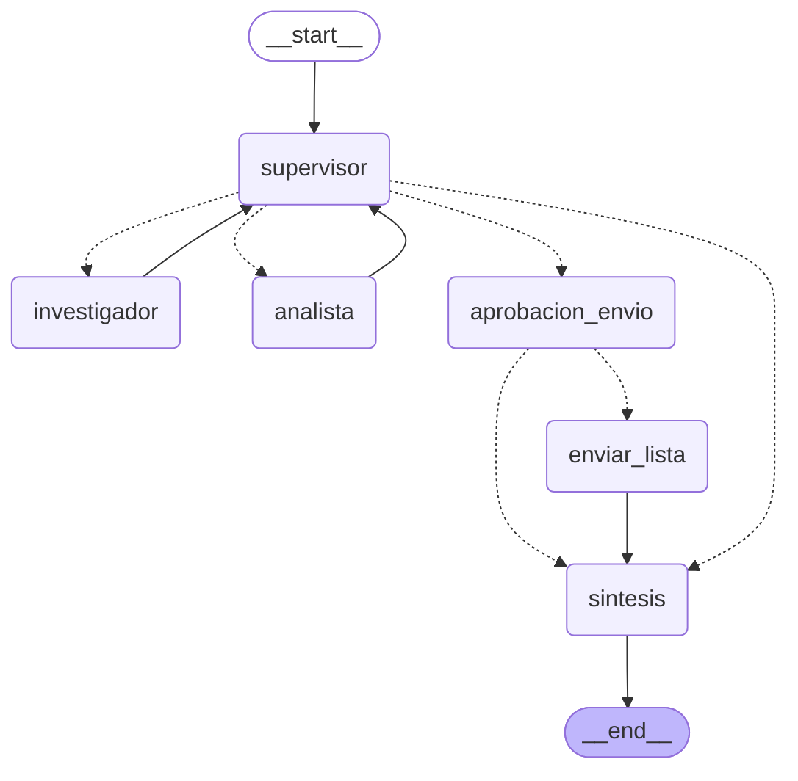
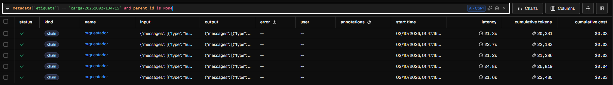
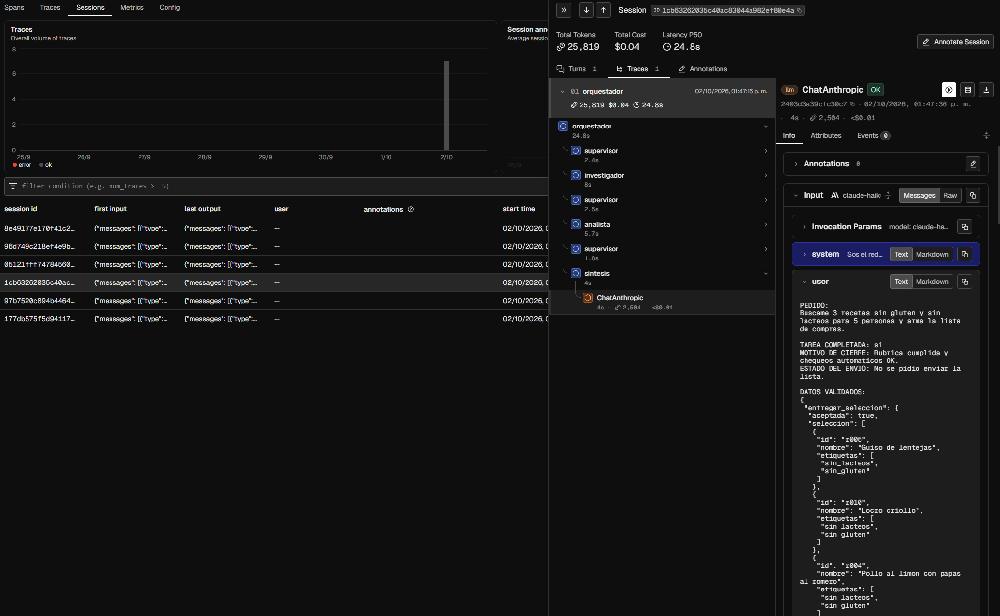
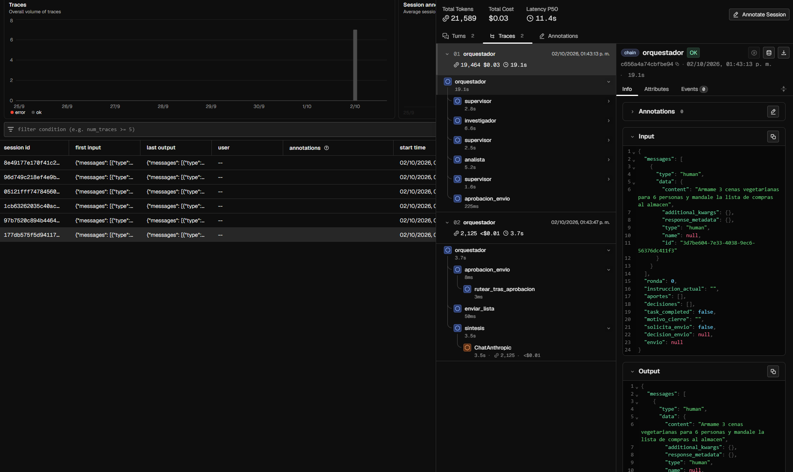
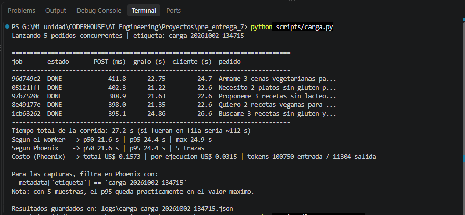
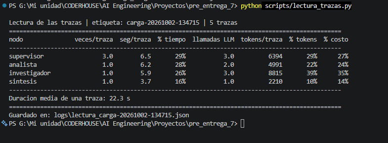

# Pre-entrega 7 — API de producción y monitoreo activo

El orquestador multi-agente de la [Pre-entrega 6](https://github.com/cvarinia/Pre-entrega-6) (un Supervisor que coordina a un Agente de Investigación y a un Agente de Análisis para armar menús con calorías y lista de compras) expuesto como un **servicio de producción**:

- una **API REST asíncrona** (FastAPI) que recibe pedidos y responde en milisegundos con un `job_id`;
- un **worker** independiente que ejecuta el grafo en segundo plano, con varios jobs a la vez;
- **Redis** como cola de trabajo, registro del estado de cada job y almacén de los checkpoints de LangGraph;
- **observabilidad** con Arize Phoenix: cada ejecución deja una traza con todos sus nodos, llamadas al modelo, tokens y costo;
- un flujo **human-in-the-loop**: antes de **enviar la lista de compras** (una acción con efecto secundario), el grafo se pausa hasta que una persona aprueba o rechaza.

---

## 1. Arquitectura

```
 Cliente               API (FastAPI)            Redis                    Worker
   │  POST /tasks          │                       │                         │
   │──────────────────────>│ 1) job:<id> = PENDING │                         │
   │                       │ 2) RPUSH cola:jobs ──>│                         │
   │<── 202 {job_id} ──────│   (milisegundos)      │<──── BLPOP ─────────────│
   │                       │                       │                         │ grafo.ainvoke(...)
   │  GET /tasks/{id}      │                       │<── RUNNING ─────────────│ thread_id = job_id
   │──────────────────────>│── lee job:<id> ──────>│                         │
   │<── {estado: RUNNING} ─│                       │<── checkpoints ─────────│
   │                       │                       │<── AWAITING_APPROVAL ───│ ⏸ interrupt()
   │  POST /tasks/{id}/approve                     │                         │   (el worker queda libre)
   │──────────────────────>│── RPUSH "reanudar" ──>│──── BLPOP ─────────────>│ ▶ Command(resume=...)
   │  GET /tasks/{id}      │                       │<── DONE + resultado ────│
   │<── {estado: DONE} ────│                       │                         │
                                                                             │ trazas (OpenTelemetry)
                                                                             ▼
                                                                    Arize Phoenix :6006
```

La API **nunca ejecuta el grafo**: un flujo multi-agente tarda 20-30 segundos (en la PE6, con Gemini, más de dos minutos), y mantener la conexión HTTP abierta todo ese tiempo terminaría en timeouts y en un servidor sin recursos para atender a nadie más. La API registra el pedido, lo encola y devuelve un número de ticket; el cliente consulta el estado cada tanto (*polling*).

### Ciclo de vida de un job

```
PENDING ──> RUNNING ──> DONE
              │  └────> FAILED   (cualquier excepción, con el motivo guardado)
              └──> AWAITING_APPROVAL ──(approve)──> PENDING ──> RUNNING ──> ...
```

### El grafo



Respecto de la PE6 se agregan dos nodos: `aprobacion_envio` (la pausa) y `enviar_lista` (el efecto secundario). El diagrama se genera desde el propio grafo con `python main.py --diagrama`.

---

## 2. Cómo cubre la consigna

| Criterio | Peso | Dónde está |
|---|---|---|
| Orquestación asíncrona y API | 30% | `app/main.py`: `POST /tasks` encola y devuelve `job_id` (202); `GET /tasks/{id}` consulta. Todo es `async`, incluido el acceso a Redis (`redis.asyncio`). El worker (`app/worker.py`) ejecuta varios jobs a la vez. |
| Persistencia con Redis | 25% | `app/jobs.py`: estado de cada job y cola. `graph.py`: checkpointer `AsyncRedisSaver`. Cualquier excepción en el worker deja el job en **FAILED** con el motivo. |
| Observabilidad | 25% | `app/observability.py`: instrumentación con OpenInference hacia Arize Phoenix. Prueba de carga con costo por ejecución y latencia p95: sección 6 y `screenshots/`. |
| Human-in-the-loop | 15% | `app/hitl.py`: nodo con `interrupt()` + `POST /tasks/{id}/approve`. |
| Documentación y estructura | 5% | Este README, `requirements.txt`, `.env.example`, `docker-compose.yml`. |

---

## 3. Estructura del repositorio

```
pre_entrega_7/
├── app/
│   ├── main.py            # API: POST /tasks, GET /tasks/{id}, POST /tasks/{id}/approve, GET /health
│   ├── worker.py          # saca jobs de la cola, ejecuta el grafo, actualiza el estado
│   ├── jobs.py            # registro de jobs y cola en Redis
│   ├── hitl.py            # nodos de aprobación (interrupt) y de envío (efecto secundario)
│   └── observability.py   # inicialización de Phoenix y contexto de cada job en las trazas
├── agents/                # supervisor, investigador, analista, síntesis (de la PE6)
├── comun/                 # configuración, LLM, reintentos, repositorio de recetas (de la PE6)
├── graph.py               # el grafo + checkpointer de Redis
├── state.py               # estado compartido y contratos Pydantic
├── main.py                # CLI: corre el grafo en la terminal (con aprobación interactiva)
├── scripts/
│   ├── carga.py           # prueba de carga: 5 peticiones concurrentes + métricas de Phoenix
│   └── lectura_trazas.py  # latencia, tokens y costo por nodo del grafo
├── tests/                 # pruebas sin consumir la API del LLM (modelo simulado)
├── data/recetas.json      # base de 18 recetas
├── logs/                  # trazas de la CLI y resultados de la prueba de carga
├── screenshots/           # capturas del dashboard de Phoenix
├── docker-compose.yml     # Redis 8 + Arize Phoenix
├── requirements.txt
└── .env.example
```

Una diferencia con la estructura de referencia de la consigna: el endpoint `POST /tasks/{id}/approve` está en `app/main.py` y no en `app/hitl.py`. Así `hitl.py` contiene solo lógica del grafo, y el worker (que lo importa) no depende de FastAPI.

---

## 4. Cómo levantarlo

### Requisitos

- Python 3.12
- Docker Desktop (para Redis y Phoenix)
- Una API key de Anthropic (o de Google Gemini: el proveedor se elige en el `.env`)

### Instalación

```bash
git clone https://github.com/cvarinia/Pre-entrega-7.git
cd Pre-entrega-7
python -m venv .venv
.venv\Scripts\activate            # Windows (en Linux/Mac: source .venv/bin/activate)
pip install -r requirements.txt
copy .env.example .env            # Windows (en Linux/Mac: cp .env.example .env)
```

Completá en `.env` la clave del proveedor (`ANTHROPIC_API_KEY` con `PROVEEDOR=anthropic`). El resto de las variables tiene valores por defecto que funcionan con el `docker-compose.yml`.

### 1) Redis y Phoenix

```bash
docker compose up -d
docker compose ps                  # pe7-redis tiene que figurar como "healthy"
```

- Redis queda en `localhost:6379`. Se usa **Redis 8** porque trae incluidos los módulos de búsqueda y JSON que necesita el checkpointer de LangGraph (con un Redis 7 sin módulos, el worker falla con `unknown command 'FT.INFO'`).
- El dashboard de Phoenix queda en **http://localhost:6006**.

### 2) Worker y API (dos terminales)

```bash
# Terminal 1
python -m app.worker
# -> Worker listo | anthropic/claude-haiku-4-5-20251001 | hasta 5 jobs a la vez | redis://localhost:6379/0

# Terminal 2
uvicorn app.main:app --reload
```

La documentación interactiva de la API queda en **http://localhost:8000/docs**: desde ahí se pueden probar todos los endpoints sin escribir comandos.

---

## 5. Cómo probarlo

### Pruebas sin costo (modelo simulado)

```bash
python -m tests.test_orquestador_offline   # el grafo de la PE6 (3 escenarios)
python -m tests.test_hitl_offline          # pausa, aprobación, rechazo, contrato, serialización (6)
python -m tests.test_api_offline           # API + worker + Redis real (necesita Redis levantado)
```

`test_api_offline` cubre el flujo completo con aprobación, los errores del cliente (404, 409, 422), la falla del agente (→ FAILED) y la concurrencia: 5 jobs de 1 segundo terminan en ~1 segundo, no en 5. En la prueba de falla se imprime un traceback: es esperado (el worker registra el error antes de marcar el job como FAILED).

### Un pedido con aprobación humana (desde `/docs`)

1. `POST /tasks` con:
   ```json
   { "pedido": "Armame 3 cenas vegetarianas para 6 personas y mandale la lista de compras al almacén" }
   ```
   Responde `202` con el `job_id`.
2. `GET /tasks/{job_id}` hasta ver `"estado": "AWAITING_APPROVAL"`. El campo `pedido_aprobacion` muestra la lista que se quiere enviar.
3. `POST /tasks/{job_id}/approve` con:
   ```json
   { "aprobado": true, "revisor": "carla", "comentario": "" }
   ```
   (con `"aprobado": false` y un comentario, la lista no se envía y la respuesta final explica el motivo).
4. `GET /tasks/{job_id}` hasta ver `"estado": "DONE"`. El comprobante del envío simulado queda en `logs/envios/`.

**Prueba de persistencia:** con el job en `AWAITING_APPROVAL`, cortar el worker (Ctrl+C), volver a lanzarlo y recién ahí aprobar. El grafo continúa desde el punto de pausa, porque su estado vive en Redis y no en la memoria del worker.

### Prueba de carga

Con el worker y la API levantados:

```bash
python scripts/carga.py            # 5 pedidos concurrentes + métricas de Phoenix
python scripts/lectura_trazas.py   # latencia, tokens y costo por nodo (de la última carga)
```

Los 5 pedidos son distintos y **ninguno pide enviar la lista**: así no se dispara la aprobación humana y la latencia mide al sistema, no el tiempo que tarda una persona en aprobar. Todos llevan la misma etiqueta (`carga-<fecha-hora>`), que viaja a las trazas como metadata y permite filtrarlas en Phoenix:

```
metadata['etiqueta'] == 'carga-20261002-134715' and parent_id is None
```

(`parent_id is None` deja solo el span raíz de cada traza: sin eso, aparecen también todos los spans internos, que llevan la misma etiqueta.)

---

## 6. Resultados de la prueba de carga

Corrida `carga-20261002-134715`, con `claude-haiku-4-5-20251001`:

| Métrica | Valor |
|---|---|
| Jobs | 5 de 5 en DONE, sin errores ni reintentos |
| Tiempo total de la corrida | **27,2 s** (en fila habrían sido ~112 s) |
| Latencia p50 / **p95** (Phoenix) | 21,6 s / **24,4 s** |
| Latencia p50 / p95 (medida por el worker) | 21,6 s / 24,4 s |
| Costo total (Phoenix) | US$ 0,1573 |
| **Costo por ejecución** (Phoenix) | **US$ 0,0315** |
| Tokens | 100.750 de entrada / 11.304 de salida |
| Respuesta de `POST /tasks` | ~400 ms |

- **Concurrencia real:** las 5 trazas arrancan en el mismo segundo (captura 1) y la corrida completa dura casi lo mismo que la ejecución más lenta.
- **La instrumentación es confiable:** el p50 y el p95 coinciden exactamente entre Phoenix y la medición independiente del worker.
- **El costo lo calcula Phoenix** a partir de los tokens de entrada y salida de cada llamada al modelo; no hubo que configurar precios.
- **Estimado vs medido:** antes de empezar estimé ~US$ 0,06 por ejecución (30-35 mil tokens de entrada, 4-5 mil de salida). El costo real fue la mitad: unos 20 mil tokens de entrada y 2.300 de salida por ejecución.
- **Sobre el p95:** con 5 muestras, el p95 queda prácticamente en el valor máximo. Sirve como evidencia del método; para que sea una métrica estable hacen falta muchas más ejecuciones.

### Capturas

| | |
|---|---|
|  | **1. Las 5 trazas de la carga**, filtradas por la etiqueta: misma hora de inicio, latencia, tokens y costo de cada ejecución. |
|  | **2. El árbol de la traza más lenta** (24,8 s): el recorrido supervisor → investigador → supervisor → analista → supervisor → síntesis, con la llamada al modelo de la síntesis seleccionada. |
|  | **3. Un job con aprobación humana**: una sesión, dos trazas (ver sección 8). |
|  | **4. Salida de `carga.py`**: duraciones por job, p50/p95 y costo por ejecución. |
|  | **5. Salida de `lectura_trazas.py`**: latencia, tokens y costo por nodo. |

---

## 7. Lectura del dashboard

| Nodo | Veces por traza | Seg. por traza | % tiempo | Llamadas al LLM | Tokens por traza | % tokens | % costo |
|---|---|---|---|---|---|---|---|
| supervisor | 3 | 6,5 | 29% | 3 | 6.394 | 29% | 27% |
| analista | 1 | 6,2 | 28% | 2 | 4.991 | 22% | 24% |
| investigador | 1 | 5,9 | 26% | 3 | 8.815 | 39% | 35% |
| sintesis | 1 | 3,7 | 16% | 1 | 2.210 | 10% | 14% |

**¿Dónde se concentra la latencia?** En ningún lado en particular: está repartida entre los cuatro nodos y ninguno pasa del 30%. Por eso acelerar un solo nodo no cambiaría mucho el total; la palanca es **reducir la cantidad de llamadas** al modelo, no hacer más rápida una.

**El Supervisor es el que más tiempo consume, sin hacer el trabajo de fondo.** Se ejecuta 3 veces por traza (~2,2 s cada una) y se lleva el 29% del tiempo y el 27% del costo. Es el **costo de coordinación** de la arquitectura jerárquica: cada vez que un especialista termina, el control vuelve al Supervisor. En la PE6 lo había señalado como "riesgo asumido" (el Supervisor como cuello de botella); acá queda medido. Es el precio del control centralizado y de la validación entre rondas.

**El Investigador es el que más tokens consume (39%).** Cada una de sus llamadas pesa ~2.900 tokens, contra ~2.100 del Supervisor. La causa es su ciclo ReAct: `buscar_recetas_por_etiqueta` devuelve fichas completas de recetas, y esas fichas se reenvían en cada llamada siguiente del investigador. En la traza más lenta (captura 2), el investigador tardó 8 s contra 5,9 s de promedio: es lo que la hace la más lenta.

**La Síntesis y el Analista cuestan más de lo que pesan en tokens** (la síntesis: 10% de los tokens, 14% del costo). Es porque **escriben mucho**: en Haiku, un token de salida cuesta 5 veces más que uno de entrada, y generar texto es más lento que leerlo. La síntesis es la llamada individual más lenta (3,7 s) por la misma razón.

### Mejoras posibles (no implementadas)

- Que la herramienta de búsqueda devuelva solo los campos que el investigador necesita: ataca directamente el 39% de tokens.
- *Prompt caching* de Anthropic para los prompts de sistema y los esquemas de herramientas, que se repiten en cada llamada.
- Rutas deterministas cuando el próximo paso es obvio (investigador → analista) para ahorrar rondas del Supervisor, a cambio de perder parte de la validación entre pasos.

---

## 8. Decisiones de diseño

**El estado del job se escribe antes de encolar.** Si fuera al revés, el worker podría tomar el job antes de que exista su registro y el cliente recibiría un 404 al consultar.

**El worker ejecuta varios jobs a la vez, con un límite.** Cada job es una tarea `asyncio` independiente; un semáforo limita cuántas corren juntas (`MAX_TRABAJOS_CONCURRENTES`). El semáforo se toma **antes** de sacar un mensaje de la cola: si el worker está lleno, los jobs esperan en Redis (donde no se pierden) y no en la memoria del proceso.

**Ninguna excepción queda sin registrar.** Todo lo que falla dentro de un job termina en FAILED con el tipo y el mensaje del error. Sin esto, el cliente quedaría consultando para siempre.

**Una aprobación por job.** Dos aprobaciones simultáneas podrían reanudar el mismo grafo dos veces. Lo evita un candado en Redis (`SET ... NX`: "escribir solo si no existe"): la segunda recibe un 409.

**La pausa y el envío son dos nodos distintos.** Al reanudar, LangGraph vuelve a ejecutar **desde el principio** el nodo que llamó a `interrupt()`. Si el envío estuviera en ese mismo nodo, se ejecutaría dos veces. Se ve en la captura 3: `aprobacion_envio` aparece en **las dos** trazas de la sesión (en la primera hace la pausa, en la segunda se reejecuta, recibe la decisión y sigue a `enviar_lista` → `sintesis`).

**El HITL depende del checkpointer.** Sin checkpointer, pausar implicaría mantener el proceso vivo esperando a una persona. Con el estado en Redis, la pausa es solo un registro: el worker queda libre para otros jobs, y la pausa sobrevive incluso a un reinicio.

**Quién decide si hay envío.** El Supervisor detecta si la persona pidió *enviar* la lista (no alcanza con pedir *verla*): es el campo `solicita_envio` de su salida estructurada. Pero el código agrega una condición más: solo se pide aprobación si la tarea además quedó **validada**. No se le pregunta a una persona si quiere enviar algo que el sistema no pudo confirmar.

**La respuesta humana tiene contrato.** `DecisionHumana` (Pydantic) se valida dos veces: en la API (un cuerpo inválido recibe 422 y no toca el job) y en el nodo al reanudar.

**Sesiones en las trazas.** Cada job usa su `job_id` como `session.id`. La ejecución inicial y la reanudación quedan agrupadas en una misma sesión (captura 3), y la espera humana (34 s en ese ejemplo: de 01:43:13 a 01:43:47) **no se suma** a la latencia del sistema: son dos trazas separadas.

**Serialización del estado en Redis.** El estado guarda modelos Pydantic propios (`Aporte`, `RegistroDecision`...). Por seguridad, LangGraph solo reconstruye tipos declarados como permitidos, y el checkpointer de Redis guarda en **JSON** (el de memoria, en msgpack). Al principio solo estaban permitidos para msgpack: los tests (con checkpointer en memoria) pasaban, pero con Redis los modelos volvían como diccionarios y el grafo fallaba al reanudar. Se corrigió en `serializador_redis()` (`graph.py`) y se agregó un test que reproduce el camino de JSON sin necesitar Redis.

**Versión de los prompts en las trazas.** Cada traza lleva `version_prompts` (en `app/observability.py`): si un cambio de prompt altera el comportamiento, el dashboard muestra qué versión estaba activa.

---

## 9. Limitaciones conocidas

- **Un job en RUNNING no sobrevive a la caída del worker.** `BLPOP` saca el mensaje de la cola al tomarlo: si el worker se cae a mitad de una ejecución, el job queda en RUNNING. La solución estándar es una "cola confiable" (`BLMOVE` a una lista de "en proceso" y reintento de lo que quedó colgado). Los jobs en AWAITING_APPROVAL, en cambio, sí sobreviven (ver la prueba de persistencia).
- **El envío es simulado:** se registra como un archivo JSON en `logs/envios/`.
- **Sin autenticación:** cualquiera que llegue a la API puede aprobar un job. En producción, `/approve` necesitaría identificar al revisor.
- **La respuesta de `POST /tasks` fue de ~400 ms en Windows** (contra ~4 ms en los tests). Sigue siendo no bloqueante; una causa probable es que en Windows `localhost` intenta primero IPv6. No se investigó a fondo.
- **La API y el worker corren fuera de Docker.** El `docker-compose.yml` levanta la infraestructura (Redis y Phoenix); contenerizar la API y el worker queda para la entrega final.
